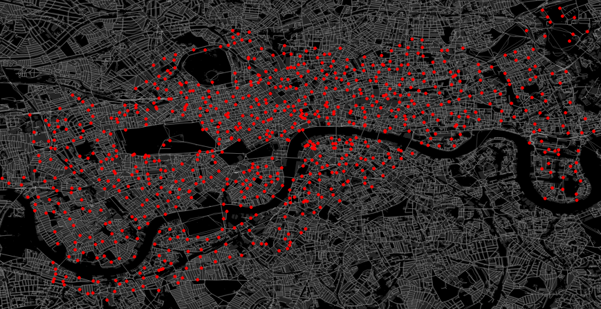
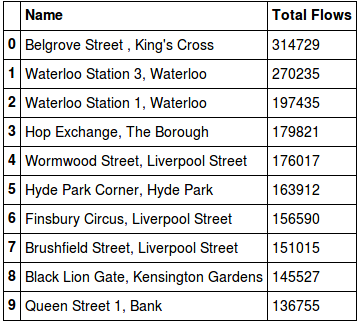
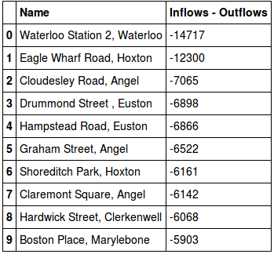
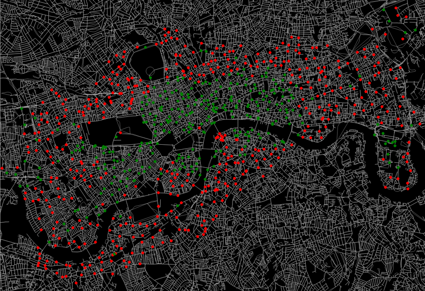
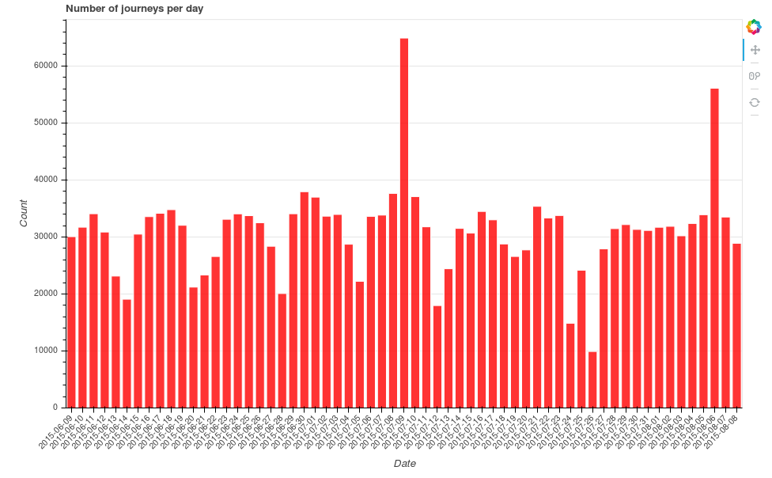
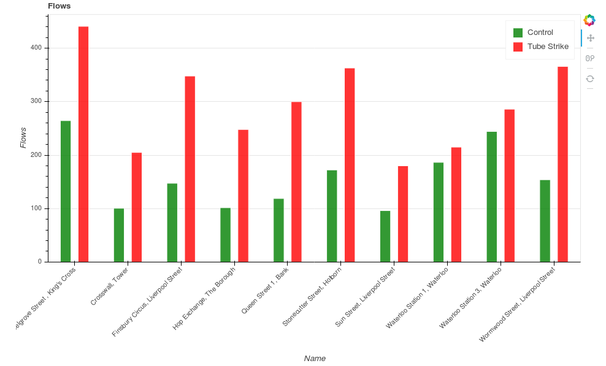

# Overview

As part of the free transport data service, Transport for London (TfL) release data on journeys taken using their Santander Cycles - aka "Boris Bikes". The data goes back to January 2015, showing information on the start and end locations of the journey, along with duration and time of day. By combining this information with the coordinates of each cycle hire point, I predicted the most likely journey taken for each start/end combination, as well as looking at the impact of tube strikes on bike usage.

For all the technical details, see the Python notebook on my [github](https://github.com/charlie1347/TfL_bikes).

# The TfL data

TfL host all of the raw cycle data on their [cycling data website](http://cycling.data.tfl.gov.uk/) as a series of CSV files. Furthermore, they also have a live [XML data feed](https://tfl.gov.uk/tfl/syndication/feeds/cycle-hire/livecyclehireupdates.xml) showing the status of each bike point in London, yielding information such as its coordinates, number of free docks, total capacity etc. 

For those unaware, below is a map of all the cycle hire stations across London. 

I've also generated a fancy interactive version of this plot in bokeh - click [here](https://charlie1347.github.io/TfL_bikes/bokeh_plots/bike_points.html) to see it (it's 30MB+, so takes a little while to load). You can zoom/scroll with this version, and it also tells you the name and capacity of each location.

# Route prediction

Given that there are 777 stations across London (at least at the time of writing), this allows for 777 * 776 = 602,952 possible journey combinations if we ignore those that start and end at the same station. Looking at my dataset, I find around 400k unique routes actually taken.

In order to plot each route, I needed to make some assumptions about how each journey was conducted, as no information on the actual route taken is available. For simplicity I have assumed that for each start/end pairing, every cyclist took the quickest route as prescribed by an online route planner. To make this assumption a bit more realistic, I also cut down my dataset to only plot routes which took up to twice as long as the route planner's expected duration - i.e. ignoring journeys where the cyclist clearly took another route (and perhaps some terribly slow people).

Whilst Google offers a cycling directions API, 400,000 requests is far beyond their free API usage limit, and far more than I'm willing to pay for. Instead, I opted to set up my own OSRM server, which I could query as many times as I liked. Details of how to set up the server can be found on [Ilia's github](https://github.com/ilkarman/Movement-Visualisations/blob/master/01_TFL_Bikes/setup_osrm_vm.txt). 

Once I had calculated the waypoints for each route, I plotted the resulting 13+ million routes using [datashader](https://github.com/bokeh/datashader), aggregating each route by the number of times it was taken (i.e. the thicker the line, the more people used that route). The full plot can be seen below:

# Analysis of flows

First, let's look at the most popular bike stations in London. Defining a single flow as either someone taking or docking a bike a station, the top bike stations across London are: 

Belgrove Street, Kings Cross is the most popular with 314,729 total flows (157,025 inflows and 157,704 outflows) across the entire dataset. The least popular on the other hand is Bevington Road, North Kensington, with 1,131 total flows (515 inflows and 616 outflows) - however this station was only installed on July 4th 2016.

An alternative way of ranking the stations is through Google's [PageRank algorithm](https://en.wikipedia.org/wiki/PageRank). The underlying theory behind the PageRank algorithm is that if a station is frequently linked to via other "important" stations, then the rank of that station will increase:

Interestingly our results differ quite a bit from the ranking simply based on number of flows. This would imply that whilst the various stations on the Strand may not have the highest number of flows, they are frequently travelled to via other "important" stations, thus being ranked highly. 

If you live in London, you've probably noticed the vans that move the bikes around during the day - taking bikes from full stations, and redistributing them to empty stations. By looking at the difference between the inflows and outflows, we can see the stations that are worst affected by this mismatch, and thus require the most redistribution.

By filtering the dataset to only look at weekdays in either the morning or evening, we can also see the commuting patterns of Londoners:

In the above, red represents a station with more bikes leaving than coming in (outflows > inflows), whilst green represents the opposite. As expected, in the morning we see people commuting in to the centre from the suburbs, whilst the opposite occurs in the evening. Canary Wharf is also quite noticeable in the east. 

An interactive version of this graph can be seen [here](https://charlie1347.github.io/TfL_bikes/bokeh_plots/mornings_evenings.html) - again, this one is 30+MB, so will take a while to load up. 

# Impact of tube strikes

On July 8th 2015, there was [London-wide tube strike](http://www.bbc.co.uk/news/uk-england-london-33440369) that occurred from 1830 in the evening until 2130 the following day. Whilst I fortunately had the option to work from home that day, many Londoners had to find alternative means of transport to get to work. By looking at this dataset, we can try to see whether any of them chose to cycle to work instead.

As a simple first metric, the following barchart shows the number of journeys taken between the 9th June and the 9th August in 2015:

##EMBED BARCHART HERE - [link](https://charlie1347.github.io/TfL_bikes/bokeh_plots/journeys_per_day.html)

There is a clear spike in journeys taken on the 9th July. The second spike? [Another tube strike](http://www.bbc.co.uk/news/live/uk-england-london-33674627).

Looking at just the morning of Thursday July 9th between 0700 and 1000, there were 16,501 journeys conducted in the capital. The same time period on the Thursdays preceding and following the strike had 9,111 and 9,215 journeys respectively - so clearly the tube strike morning had a lot more journeys. To test this statistically, I defined a larger control group set at a month either side of the tube strike, ignoring weekends (a total of 43 days). We get an average of 8,579 journeys per morning in this control group, and with a standard deviation of 1,295, the number of journeys taken on the morning of the tube strike indeed does appear statistically different from the average (using a simple t-test).

Looking at the individual bike stations, the following graph shows the average number of uses (inflows + outflows) in the control group for the top 10 bike points, comparing this to the usage on the morning of the tube strike:

##EMBED BARCHART HERE [link](https://charlie1347.github.io/TfL_bikes/bokeh_plots/top_stations.html)

The TfL dataset also gives information on the time taken to complete a route. Looking at the distribution of journey duration between the control group and tube strike morning, we get the following histograms:

##EMBED HISTOGRAM HERE [link](https://charlie1347.github.io/TfL_bikes/bokeh_plots/histogram.html)

Comparing the two, it would appear that on average, journeys did indeed take longer on the tube strike morning - the modal bin for the control group occurs at less than 10 minutes, whereas for the tube strike morning it is over 16 minutes. Formally we can test this using a [two-sample Kolmogorov-Smirnov test](https://en.wikipedia.org/wiki/Kolmogorov%E2%80%93Smirnov_test#Two-sample_Kolmogorov.E2.80.93Smirnov_test), which tests whether two samples come from the same distribution. Using this test, I find that the two samples are statistically different - i.e. journeys did take longer on the tube strike morning. 
